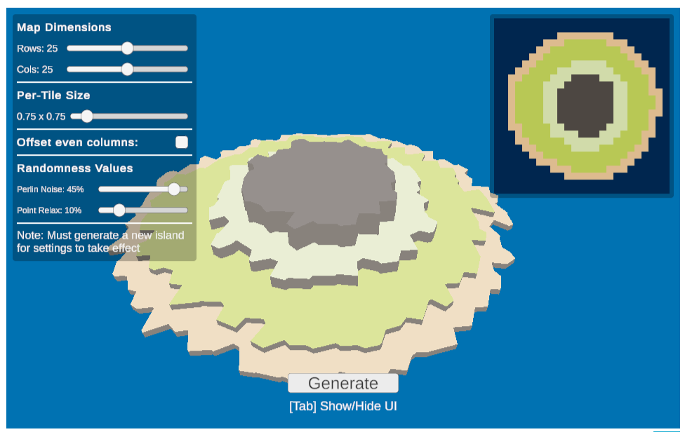
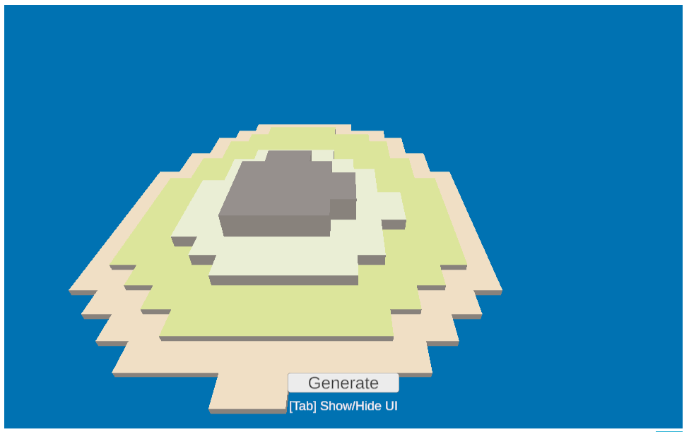
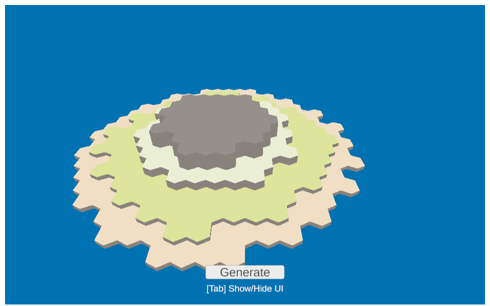
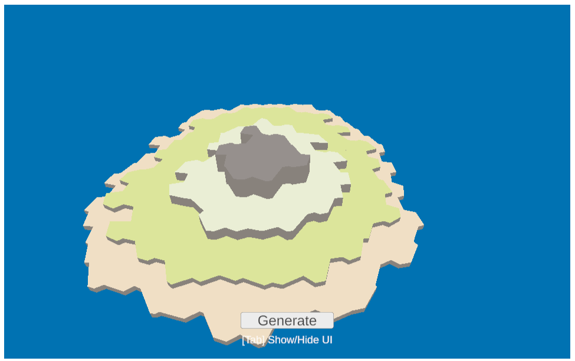

# Procedural Terrain Manipulation Using Voronoi Areas

Caroline Pasyanos

CSCI 716: Computational Geometry

### A playable demo is available [here](https://pasyanos.github.io/Voronoi-Tiles/)!
### Full Presentation Video [here](https://www.youtube.com/watch?v=8Xx3i11P-_8)

See the User Manual Section for more information on running the demo.

## Overview

Tile based terrain generation is a common approach to procedural terrain, but a major drawback is that it creates incredibly inorganic terrain. My project is a terrain generator that still relies on tiles while using Voronoi diagrams to create a more organic terrain generator. 

## User Manual

The goal was to expose the most impactful settings to the user to illustrate the flexibility of the system. 

Pressing the tab key toggles the settings menu and the tile map key on or off.

The camera can be rotated using the left and right arrow keys OR the A and D keys to see all sides of the terrain.

### Map Dimensions:

Set the number of tiles to generate. Supports a range between 10 and 40 tiles in either direction. Rows and columns can be seperately assigned.

**NOTE:** Larger maps may not fit in the camera without decreasing per-tile size.

### Per-tile Size

Controls both the x and y size of a tile at once. Can be set between 0.5 and 3 units (defaults to 1 unit).

### Offset Even Columns

Toggles whether to offset the tile center of every other column of tiles. When this is on, the finished map will have more hexagonal-looking tiles. When it is off, tiles will have a more square appearance.

### Randomness Values

**Perlin noise** controls the maximum amount that the tile center can be moved by Perlin noise.

**Point Relax** controls the amount that a tile center is moved towards its neighbors of the same terrain type. This is always the same amount (unlike Perlin noise, which is variable).

For more details on these settings, see the **Tile Center Manipulation** section in **Implementation Details**.

## Background
Much of this project is based on the developer blog Tiles to Curves from independent game developer Ludomotion. They created a tool for map content generation that outputs terrain information in the form of a tile map. For my final project, I decided to extend their idea to a procedural terrain generator. 

### Tile Maps

Tile maps encode terrain information in a convenient data structure and allow for the creation of many possible maps from relatively few tiles. However, they are also very rigid. By nature they are very blocky and inorganic looking, so it is often obvious where the underlying grid is. The key idea in Ludomotion’s post is to modulate the look of tiles using a Voronoi diagram, where each tile in a tile map is mapped to an area in the Voronoi diagram.

### Voronoi Diagrams

A voronoi diagram is a tessellation pattern where given points determine subdivisions of a plane into voronoi areas. Each voronoi area (also referred to as a cell) is defined such that every point enclosed in a given area is closer to the point defining that area than any other point.

## Implementation Details

### Step 1: Tile Map Generation

Note: Some settings are able to be tweaked in the demo. For more information, refer to the User Manual section above.

The tile generator creates a tile map, a 2D grid of tiles. Each tile is one of the following types of terrain:
- Water
- Shore
- Ground
- Low hill
- High mountain

The color and height of each terrain is customizable in the Unity editor, but these settings are not exposed in the demo. 
The mesh generation algorithm uses both the color and height settings. It relies on each subsequent terrain type to have a height higher than the previous type.

Terrain types are stored in a 2D array. A second array of Vector2s stores the center point of each tile in world coordinates. Both arrays have the dimensions rows by columns. 

Before beginning generation, the algorithm creates a 2D look-up table of float weight values with the same dimensions as the tile grid. For both the x and y value, a value is interpolated from a minimum to a maximum value based on how close the value is to the map’s center. 
Rather than a linear interpolation, I make use of a [Unity animation curve](https://docs.unity3d.com/6000.0/Documentation/ScriptReference/AnimationCurve.html). The values for the x and y axis are multiplied together then stored in the lookup table.
Like the terrain type setting, the animation curve is exposed in the Unity editor, but cannot be changed in the build.

Procedural tile generation proceeds as follows:
- First, each edge tile is filled in with water.
- Next, for each internal tile, I sample a 2D Perlin noise texture to get a value in the range [0,1], then weigh it by the value stored in the look-up table. I convert this value to an integer in the range [0, 100]. Anything below 7 is a water tile. The range [7, 30) is a ground tile, [30, 45) is low hill, and anything 45 or above is a high mountain.
- Finally, in a second pass through every tile, I go through and change all ground tiles that have at least one water neighbor to shore tiles to give it even more of an island look. Hill or mountain tiles that border water will remain, to mimic the look of islands that have cliff edges, but it is unlikely.

A 2D map of the underlying procedural tile map is displayed in the upper right corner when UI is toggled on (see the **User Manual** section).

### Step 2: Tile Center Manipulation

The key to creating organic looking terrain is seeding a 2D plane with points for each tile, then generating a Voronoi area. Augmenting the tile centers before generating the diagram is an incredibly necessary step for achieving organic maps. Without these augmentations, the resulting Voronoi diagram would just be a grid of uniform shapes.

Here is what the terrain looks like without any noise or relaxation applied (without and with the column offset):

I initialize a 2D array of Vector2s with the dimensions rows x columns representing the ***local*** offset from the center of the tile. The default is (0, 0), representing no offset from the global position.
Following Ludomotion’s post, tile centers are augmented in three ways.

1. Offsetting even columns

An optional toggle offsets the points in every other column by half of the height of a tile.

2. Randomize points

The tile center is randomized by a small amount in the x and y direction. I use 2D Perlin noise once again.

3. Relax towards like neighbors

Finally, the center of the tile is moved towards orthogonal neighbors of the same type, and away from orthogonal neighbors of different types. The amount of movement can also be adjusted in the demo build.

Once the local offset for each tile is calculated, I apply it to the global tile point stored from the tile generation step.

### Step 3: Generating Voronoi Diagrams

In order to focus  more fully on procedural terrain generation and creating meshes, I use an external package to generate a Voronoi diagram. The package, [Unity-Delauney](https://github.com/jceipek/Unity-delaunay/tree/master) is unfortunately no longer maintained, but still works in the modern version of Unity I used. 
The package contains a C#/Unity port of Fortune's Algorithm. Fortune's Algorithm is a plane sweep approach to generating Voronoi areas. 

I flatten the 2D array of points into a 1D array, then pass it to the Voronoi generator. 

Once it is run, each Voronoi area in the diagram can be queried by the site's point, and is stored as a collection of points, which will be used in the mesh generation step.

### Step 4: Mesh Generation

**Mesh Generation and Rendering in Unity**: At the very least, Unity meshes need a list of vertices and a list of indices that dictate how the list of vertices is triangulated. 

To render my terrain mesh, I rely on these two required inputs as well as the optional vertex color attribute. 
Unity's standard shader (the default shader for materials) does NOT support vertex color, so in order to render this attribute, I use an unlit particle shader which does.

I created several supporting classes to store mesh information before I am ready to render the mesh (I refer to these as mesh storage classes). 

Also, by default, only one side of the triangle face (the front face) is rendered. 
In Unity, the front face of a triangle is indicated by a clockwise order of points, so it is up to my program to ensure the correct winding order when generating mesh information.

Mesh generation proceeds as follows:

For each tile center:
- query the voronoi diagram for the Voronoi area (returned as a list of points)
- sort list of points in clockwise order (this implementation of Fortune's algorithm does not guarantee point winding order)
- triangulate Voronoi area polygon using [Fan Triangulation](https://en.wikipedia.org/wiki/Fan_triangulation)
- assign terrain color to each vertex of the Voronoi area polygon
- for each line segment in the polygon, create a vertical wall from two triangles, then ssign wall color to each vertex.
- Add vertex, index, and color information for the polygon and each wall to the mesh storage class. 

Once each tile center is processed, I query the mesh storage class for an array of vertices, indices, and colors and pass this to a new [Mesh](https://docs.unity3d.com/ScriptReference/Mesh.html) object. I assign this to an instance of a Unity [Mesh Filter](https://docs.unity3d.com/6000.0/Documentation/ScriptReference/MeshFilter.html), and the final terrain is rendered in scene.

## Tools

- Unity Engine
- WebGL
- C#

## Project History

- 10/27/24 - Basic tile generation with placeholder assets finalized. First Github pages build published.
- 11/16/24 - Voronoi area generation added.
- 12/04/24 - Mesh generation using Voronoi areas. Build updated.
- 12/07/24 - UI updates, build updated.
- 12/11/24 - Added UI hooks to demo to allow adjustment of parameters. F
- 12/12/24 - Final build.
- 12/13/24 - Final documentation.

## References

- [Ludomotion: Tiles to Curves](https://www.ludomotion.com/blogs/tiles-to-curves/)
- [Ludomotion: Generating World Maps for Unexplored 2](https://www.ludomotion.com/blogs/generating-world-maps/)
- [Unity-delauney](https://github.com/jceipek/Unity-delaunay/tree/master)
- [How To Host Unity a WebGL Game on Github for Free](https://www.youtube.com/watch?v=4jvGgn4b1V8)
- [Creating a Mesh](https://catlikecoding.com/unity/tutorials/procedural-meshes/creating-a-mesh/)
- [Voronoi Diagrams](https://en.wikipedia.org/wiki/Voronoi_diagram)
- [The Fascinating World of Voronoi Diagrams](https://builtin.com/data-science/voronoi-diagram)
- [Fortune's Algorithm: An Intuitive Explanation](https://jacquesheunis.com/post/fortunes-algorithm/)
- [Perlin Noise](https://en.wikipedia.org/wiki/Perlin_noise)
- [Fan Triangulation](https://en.wikipedia.org/wiki/Fan_triangulation)
